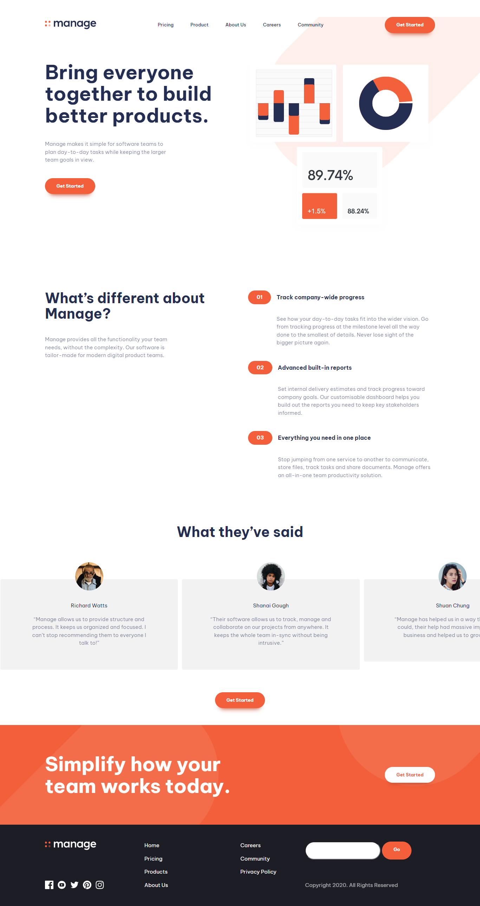

# Front End Mentor Challenges



## [**Manage Landing Page**](https://www.frontendmentor.io/challenges/manage-landing-page-SLXqC6P5)

- **Level : `Intermediate`**

- **Tools : `HTML, CSS, JS, a11y slider`**

## What I Learned

This challenge will be a great test for your responsive skills. There are lots of small details and slight content shifts for different screen sizes.

## Brief

Your challenge is to build out this landing page and get it looking as close to the design as possible.

You can use any tools you like to help you complete the challenge. So if you've got something you'd like to practice, feel free to give it a go.

## `Your users should be able to:`

- View the optimal layout for the site depending on their device's screen size
- See hover states for all interactive elements on the page
- See all testimonials in a horizontal slider
- Receive an error message when the newsletter sign up form is submitted if:
  - The input field is empty
  - The email address is not formatted correctly

# Running the project

- in development evironment

```bash
npm run dev
```

- for Production

```bash
npm run build
```
